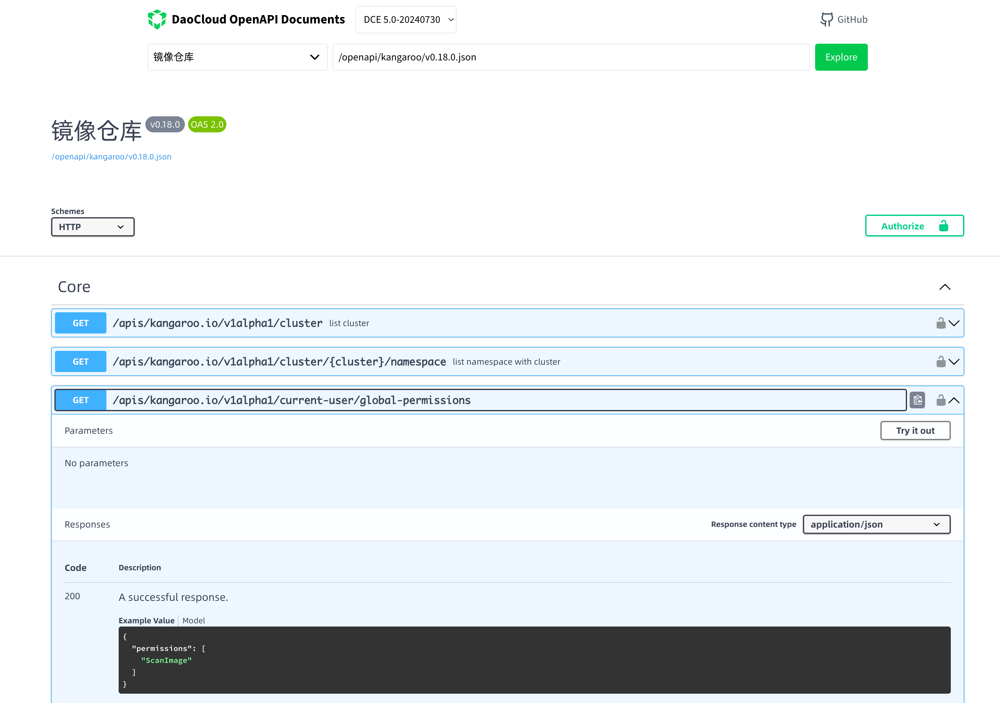

# Getting Started

This project was bootstrapped with [Create React App](https://github.com/facebook/create-react-app).

## Running

In the project directory, you can run:

### `npm start`

Runs the app in the development mode.\
Open [http://localhost:3000](http://localhost:3000) to view it in your browser.

The page will reload when you make changes.\
You may also see any lint errors in the console.

## Configuring

- The configuration of DCE version and Swagger file information is in the `src/apiContianers.js` file.
- Modify the `proxy` in the `package.json` file to point to the correct DCE server.